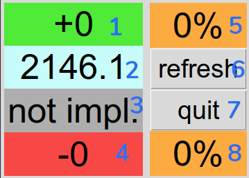

# xrankpowerpredict (for solo q)

i was inspired by [snowpoke's](https://www.twitch.tv/snowpoke) prediction system and wanted to do some predicting myself.

beware, it's ugly python code.

## setup

> thanks to good ol' ninty, this is hella complicated.

we need the `iksm_session` token that the nintendo switch online app uses for auth, etc.

> how do i get that token?

[here's a guide](https://github.com/frozenpandaman/splatnet2statink/wiki/mitmproxy-instructions). beware that if you try this on android, you'll need an android version below 7.0 (nougat), because later versions have a different policy for user-imported certificates.

if you're lucky (like me), you have an old phone with android 6.0 (marshmallow) lying around, otherwise you'd need to screw around with android virtual machines (probably not that fun tbh).

## how do i run this?

first, paste your token into the script.

then do `python3 [path to script]` before the match starts. hit 'refresh' some time after the lobby screen says 'BATTLE TIME!'. 

happy _VEEEEMO_

### the ui

1: an estimate of the points you'd gain (windelta, can be inflated)

2: your current xpower

3: how your xpower changed during this rotation (rotationdelta, not yet implemented)

4: how much you'd lose (losedelta)

5: chance of winning (based on windelta & losedelta)

6: refresh, press this after the match starts

7: exit the program

8: chance of losing (based on windelta & losedelta)

## how does this work

magic, obviously.

... jk. as soon as a match starts your xpower (in the app) is updated to the value that it'd be if you lost the match.
using _math_ and other _magic_ we can - somewhat accurately - estimate the points you'd gain. i got the formulas by messing around in google sheets with some test data.
they're not optimal, the value of `win delta` (points you'd gain) is sometimes inflated. dunno how to fix that atm.

## etc

license: gpl3

