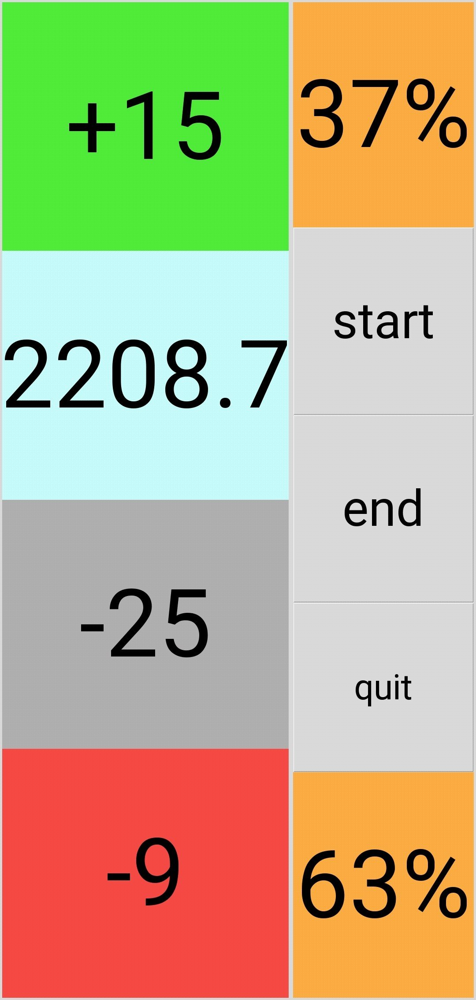

# xrankpowerpredict

i was inspired by [snowpoke's](https://www.twitch.tv/snowpoke) prediction system and wanted to do some predicting myself.

**when this script works:**

in x rank solo queue, except during the 10 placement matches and the first regular match (at least it didn't work during testing).

also: beware, it's ugly python code.

## setup

> thanks to good ol' ninty, this is hella complicated.

we need the `iksm_session` token that the nintendo switch online app uses for auth, etc.

> how do i get that token?

[here's a guide](https://github.com/frozenpandaman/splatnet2statink/wiki/mitmproxy-instructions). beware that if you try this on android, you'll need an android version below 7.0 (nougat), because later versions have a different policy for user-imported certificates.

if you're lucky (like me), you have an old phone with android 6.0 (marshmallow) lying around, otherwise you'd need to screw around with android virtual machines (probably not that fun tbh).

## how do i run this?

first, adjust the config options in the script.

then do `python3 [path to script]`

this also somewhat works on mobile, using [this android app](https://play.google.com/store/apps/details?id=ru.iiec.pydroid3).

instructions:

1. in that app: side panel > pip: install `python-dateutil` and `requests`
2. top bar > folder icon > open: select xpowerpredict.py
3. click the play button

depending on the aspect ratio of your phone, you might want to adjust `lframe_width` and `rframe_width`.

happy _VEEEEMO_

### when to press the buttons
start: after the lobby screen says 'BATTLE TIME!'.

end: when the results are shown (level/rank/kills/etc screen).

doing this anytime else might skew the values and cause errors.

### the ui

1: an estimate of the points you'd gain (windelta, can be inflated)

2: your current xpower

3: how your initial xpower has changed (while the script was running), i.e. the difference between initial and current xpower

4: how much you'd lose (losedelta)

5: chance of winning (based on windelta & losedelta)

6: start button

7: end button

8: exit the program

9: chance of losing (based on windelta & losedelta)

on mobile (with `lframe_width`and `rframe_width` adjusted):

## how does this work

magic, obviously.

... jk. as soon as a match starts your xpower (in the app) is updated to the value that it'd be if you lost the match.
using _math_ and other _magic_ we can - somewhat accurately - estimate the points you'd gain. i got the formulas by messing around in google sheets with some test data.
they're not optimal, the value of `win delta` (points you'd gain) is sometimes inflated. dunno how to fix that atm.

## etc

license: gpl3

